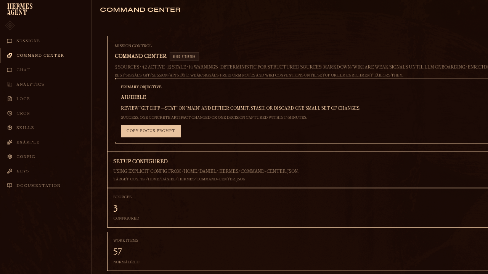

# Hermes Command Center

A local mission-control dashboard plugin for Hermes Agent.

Command Center turns scattered agent work into a prioritized dashboard: source diagnostics, attention items, restart scripts, and copyable focus prompts.



## Why

Agent-heavy workflows create loose ends everywhere:

- half-finished chat sessions
- dirty local repos
- project notes with stale next actions
- wiki/reference systems with unclear health

Command Center gives Hermes a read-only “what needs attention?” layer so users can restart work without digging through history.

## Current sources

- **Hermes Sessions** — finds large/stale sessions that need summarizing or closure.
- **Local Git Repos** — finds dirty repos, stale branches, unpushed/ahead/behind state, and TODO/FIXME markers in changed files.
- **Markdown Work Notes** — reads explicitly configured project/capture folders.

## Design choice: hybrid-ready, not fake magic

Structured sources are deterministic:

- git status
- session metadata
- configured filesystem paths

Freeform notes are weak signals unless the user has conventions. Command Center supports a one-time local setup prompt so a persona/local agent can inspect the user’s actual system and write a tailored config.

## Features

- Mission Control summary
- Primary Objective with a 15-minute restart prompt
- Setup configured / setup needed card
- Attention Queue
- Source Diagnostics
- Work/Mission feed with filters for code, sessions, stale items, and notes
- Read-only by default

## Install

Copy the dashboard plugin into your Hermes plugin directory:

```bash
mkdir -p ~/.hermes/plugins/command-center
cp -R dashboard ~/.hermes/plugins/command-center/
```

Restart the Hermes dashboard:

```bash
hermes dashboard --host 0.0.0.0 --port 9119 --no-open --insecure
```

Open:

```text
http://127.0.0.1:9119/command-center
```

## Configure

Create `~/.hermes/command-center.json`:

```json
{
  "workspace_name": "Personal Command Center",
  "workspace_root": "/absolute/path/to/vault-or-workspace",
  "projects_dir": "projects",
  "captures_dir": "captures",
  "wiki_path": null,
  "git_roots": ["/absolute/path/to/code"],
  "enable_projects": true,
  "enable_wiki": false,
  "enable_sessions": true,
  "enable_git": true,
  "default_stale_after_days": 7,
  "git_stale_days": 14,
  "session_stale_days": 7
}
```

Or set:

```bash
COMMAND_CENTER_CONFIG=/path/to/command-center.json
```

## One-time setup prompt

The dashboard exposes:

```text
/api/plugins/command-center/setup-prompt
```

The UI also includes a **Copy setup prompt** button. Paste that into a local Hermes session and let the agent inspect read-only, ask before broad assumptions, and write the tailored config.

## Hackathon demo path

1. Open Command Center.
2. Show **Setup configured**.
3. Show **Local Git Repos** in Source Diagnostics.
4. Show **Attention Queue** with dirty repos.
5. Show **Primary Objective** and copy the focus prompt.

## Next adapters

- GitHub PR/issues adapter
- Linear adapter
- Notion adapter
- LLM enrichment for ambiguous freeform notes
- Cached daily snapshots / trend history

## License

MIT
